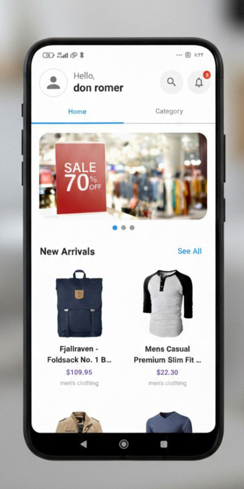
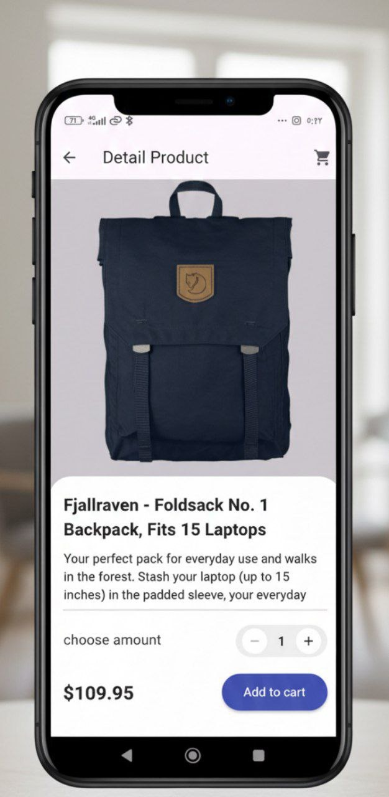
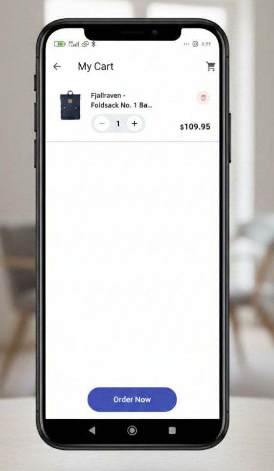
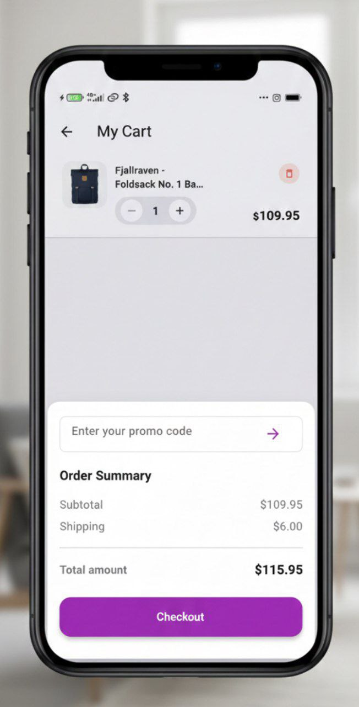

# ecommerce_app

A Flutter-based e-commerce starter app providing a clean, modular foundation for building mobile storefronts and shopping experiences.

## Features
- Product listing, detail view, and search
- Shopping cart with add/remove/update quantity
- Simple checkout flow (mocked)
- Local state management (Provider / Riverpod ready)
- Responsive UI and basic theming
- Unit and widget testing examples

## Screenshot

- 
- 
- 
- 
- 
- 

## Getting started

Prerequisites
- Flutter 3.0+ SDK
- Dart (bundled with Flutter)
- Android Studio / VS Code

Install
1. Clone the repo:
    git clone <repo-url>
2. Open the project:
    cd ecommerce_app
3. Install dependencies:
    flutter pub get

Run
- Debug on connected device/emulator:
  flutter run
- Run tests:
  flutter test

Build release
- Android (APK):
  flutter build apk --release
- iOS:
  flutter build ios --release

## Project structure
- lib/
  - main.dart — app entry
  - src/
     - models/ — data models
     - providers/ — state management
     - services/ — API / data services
     - ui/ — screens and widgets
- assets/ — images, icons, mock data
- test/ — unit and widget tests

## Configuration
- Update API endpoints and keys in lib/src/services/
- Add assets in assets/ and declare them in pubspec.yaml

## Contributing
- Fork, create a feature branch, add tests, and open a PR
- Keep commits small and focused; follow conventional commit messages

## License
This project is available under the MIT License. See LICENSE for details.

## Contact
For issues or feature requests, open an issue in the repository.

Enjoy building!
